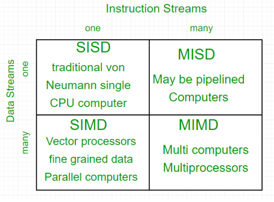
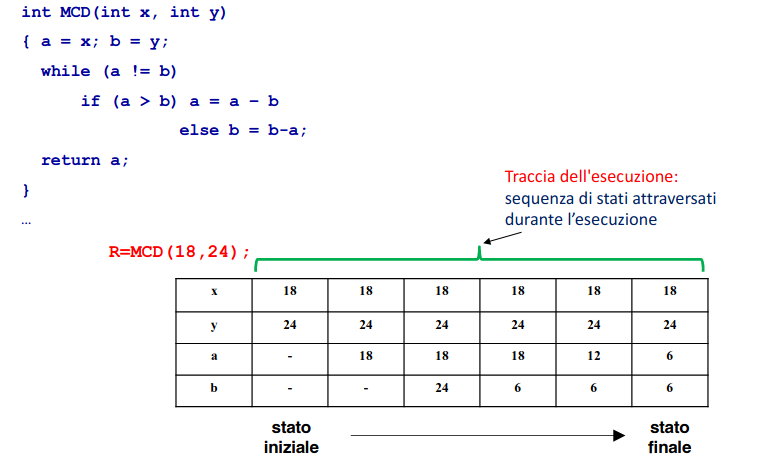
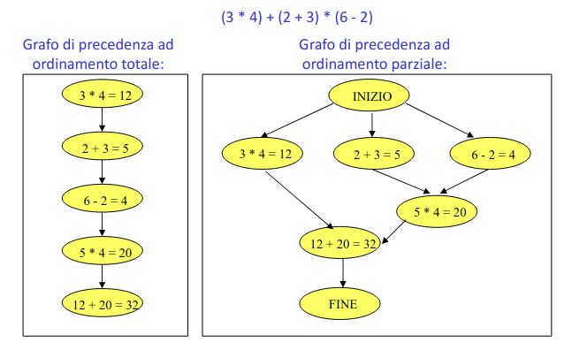

### Programmazione concorrente

Il meccanismo delle interruzioni è stato utilizzato nei sistemi time-sharing.

Lo stesso programma concorrente mandato in istanti diversi può mandare a
risultati diversi dopo l'esecuzione.

Negli anni '60 i computer erano un unica unità di elaborazione, ma oggi sono
molteplici, ad esempio nei multiprocessori.\
Nei sistemi multiprocessore abbiamo vantaggi in termini di prestazioni, perché
abbiamo un parallelismo reale, quindi i tempi di esecuzione si abbattono.
È comunque necessario che le attività concorrenti possano interagire fra di
loro, ad esempio imporre vincoli di precedenza.\
Il programmatore è vincolato da alcuni aspetti dell'applicazione che sviluppa.\

Vi sono vari tipi di architettura:
- **Single processor**: ho una cpu, una memoria centrale e posso avere tipicamente
due livelli di cache
- **Shared-Memory Multiprocessors**: è un caso più frequente e consiste in più cpu
che fanno riferimento ad una cache locale a ciascuna unità, e si connette al
resto del sistema tramite una rete di interconnessione. Ogni nodo ha la
possibilità di accedere a qualunque parte della memoria grazie a questa rete. La
memoria è condivisa tra le unità computazionali

2 modelli di sistemi multiprocessore:
- **UMA**: sistemi con un numero ridotto di processori (da 2 a 30 circa):
    - l'interconnessione è fornita dal memory bus o dal crossbar switch
    - qualsiasi sia la cella di memoria alla quale voglio accedere, il tempo di
    accesso è costante.
    - questi sistemi si chiamano anche SMP, Symmetric Multiprocessors.
- **NUMA**: sistemi con un numero elevato di processori (decine o centinaia):
la memoria è organizzata in modo gerarchico, in modo tale che ogni
processore abbia parti di memoria con tempo di accesso inferiore, e altre
più lontane che richiedono un tempo di accesso più alto.

Memoria distribuita: multicomputer e network systems 

Multicomputer: i processori e la rete sono vicini (nella stessa struttura). La
rete di interconnessione in questi casi è ad alta velocità e fornisce una grande
larghezza di banda.

La differenza tra i due modelli sta nel fatto che nei network systems ogni nodo
è un computer completo, collegato agli altri attraverso una rete locale oppure
una rete geografica. In questi casi l'accoppiamento è più lasco.\
I multicomputer sono progettati per essere un unico sistema, mentre nei network
systems abbiamo un aggregazione.

Sia in un caso che nell'altro i nodi di un sistema possono essere a loro volta
multiprocessore.

#### Classificazione classica delle architetture: Tassonomia di Flynn

Questa è una classificazione nella quale vengono inquadrate le architetture
attraverso due parametri:
- **parallelismo a livello di istruzioni**:
    - Single Instruction Stream: parallelismo a livello di singola istruzione
    - Multiple Instruction Streams: parallelismo di flussi di istruzioni
- **parallelismo a livello dei dati**:
    - single data stream: è in grado di gestire un unico flusso sequenziale di
    dati 
    - multiple data stream: è in grado di gestire più flussi di dati paralleli

**SISD**: elaboratore monoprocessore (modello Von Neumann)\
**SIMD**: migliaia di unità di computazione che messi insieme possono
realizzare calcoli complessi molto velocemente.
Array processors: sistemi con molte unità di elaborazione, simili ad una ALU in
un normale processore. Ognuna unità può eseguire istruzioni diverse su dati
diversi ma sono controllate da un unica unità\
**MIMD**: il sistema è in grado di gestire istruzioni concorrenti ognuno dei quali
lavora su insiemi di dati diversi. I sistemi multiprocessore possono rientrare
in questa categoria\
**MISD**: il sistema può gestire un unico flusso di dati che può essere
computato da più flussi di istruzioni. È più difficile da immaginare e ha utilizzi più
rari.

Applicazioni:
- multithreaded: applicazioni strutturate su più processi che possono "dominare"
la complessità del problema, aumentare l'efficienza e semplificare la
programmazione secondo un modello di scomposizione dell'algoritmo in più parti
che possono procedere contemporaeamente.\
Possono condividere variabili, possono essere schedulati indipendentemente, ma
soprattutto in questo caso esistono più processi che processori. 
- sistemi multitasking/distribuiti: Le componenti dell'applicazione vengono
eseguite su nodi
I processi comunicando scambiandosi messaggi.

Un algoritmo è un processo logico per risolvere un determinato problema.\
Un programma è una descrizione di un algoritmo mediante un formalismo (linguaggi
di programmazione) che rende possibile l'esecuzione dell'algoritmo da parte
dell'elaboratore.\
Un processo è un insieme ordinato di eventi a cui dà luogo l'elaboratore quando
opera sotto il controllo di un programma.
Un programma non descrive un solo processo ma un insieme di processi. Ogni volta
che metto in esecuzione un programma genera un processo. Per processo
sequenziale si intende una vera e propria sequenza, quindi devono essere
ordinati.

Un esempio di un algoritmo è il seguente:

Un processo può essere rappresentato attraverso un grafo chiamato grafo di
precedenza, costituito da nodi ed archi orientati. Ogni nodo rappresenta un
evento scaturito durante l'esecuzione di un programma.

In un processo non sequenziale, l'insieme degli eventi che lo descrive è
ordinato secondo una relazione d'ordine parziale.

Questo grafo ad ordinamento parziale descrive in modo corretto come ottenere il
risultato dall'espressione da cui siamo partiti. In questo caso non tutti i nodi
non sono legati da una relazione d'ordine (ad esempio i nodi allineati
orizzontalmente).

_\*altri grafi sulle slide\*_

Un linguaggio concorrente mi consente di modellare il programma come un insieme
di attività concorrenti. In Java ad esempio è possibile ereditare classi dalla
classe `Thread`.

In alcuni linguaggi il parallelismo può essere espresso a livello di singole
istruzioni, o nel caso più frequente a livello di sequenze di istruzioni.

Quando parliamo di processi di insiemi sequenziali dobbiamo capire la differenza
tra insiemi di processi dipendenti e indipendenti. Possiamo avere grafi che
non sono legati fra loro da vincoli di precedenza, ma questo è più raro.

In grafi connessi ad ordinamento parziale è possibile scomporre il processo
globale in più processi sequenziali, individuando sul grafo un insieme $P1...Pn$
di sequenze di nodi.
