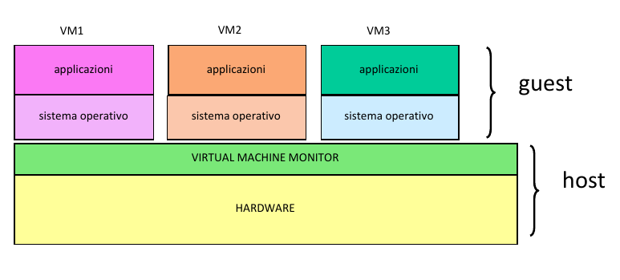
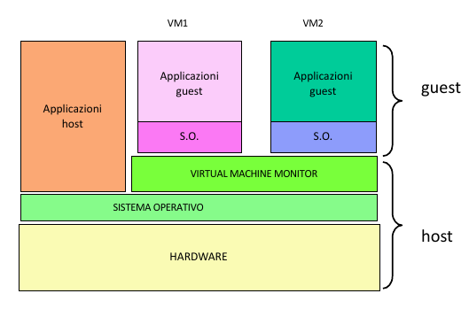

[[Index](https://github.com/mikyll/Sistemi-Operativi-M/tree/main/flashcard)]&nbsp;&nbsp;
[<<]
[&nbsp;<&nbsp;]
[[&nbsp;>&nbsp;](https://github.com/mikyll/Sistemi-Operativi-M/blob/main/flashcard/02%20-%20Protezione.md)]
[[>>](https://github.com/mikyll/Sistemi-Operativi-M/blob/main/flashcard/11%20-%20HPC.md)]

<h1 align="center">VIRTUALIZZAZIONE</h1>

### 1. Aspetti Importanti nella Realizzazione di un VMM (Requisiti)

<details>
  <summary><b>Visualizza risposta</b></summary>

  Il Virtual Machine Monitor (VMM, o Hypervisor) consente di la condivisione da parte di più macchine virtuali della stessa piattaforma hardware. Gestisce le interazioni tra le macchine virtuali e l’hardware sottostante, in modo da garantire:

  - isolamento tra le macchine virtuali;
  - stabilità del sistema.
  
  Il VMM deve quindi offrire le risorse virtuali necessarie per il funzionamento delle macchine virtuali, tra cui:
  - CPU
  - memoria (RAM)
  - dispositivi di I/O.
  
  A tal scopo sono necessari diversi requisiti per la realizzazione del VMM.
  
  1. Ambiente di esecuzione dei programmi praticamente identico a quello della macchina reale: garantire che gli stessi programmi che funzionano su architetture non virtualizzate possano essere eseguiti nelle VM senza modifiche.
  
  2. Garantire una elevata efficienza nell’esecuzione dei programmi: le istruzioni non privilegiate devono venire eseguite direttamente in hardware senza coinvolgere il VMM.
  
  3. Garantire la sicurezza e la stabilità dell’intero sistema: i programmi in esecuzione sulle macchine virtuali non possono effettuare l’accesso in modo privilegiato all’hardware.
</details>

### 2. Compiti di un VMM

<details>
  <summary><b>Visualizza risposta</b></summary>
  
  Il VMM è l'unico mediatore tra HW e SW, e ha il compito di consentire la condivisione di una singola macchina HW a più VM guest, realizzando per ciascuna una sandbox al fine di garantire isolamento e stabilità (del sistema e delle singole VM). Nel caso di un VMM di sistema dev'essere l'unico componente ad avere il pieno controllo dell'HW e a poter eseguire le istruzioni privilegiate (unico componente ad eseguire al ring 0).
  Ha il compito di gestione delle VM: creazione, spegnimento/accensione, eliminazione, migrazione live.
</details>

### 3. Classificazione del VMM

<details>
  <summary><b>Visualizza risposta</b></summary>
  
I diversi tipi di VMM si classificano in base a due parametri:
1. il *livello* a cui si collocano:
    - **VMM di Sistema** - il VMM esegue <ins>direttamente sull'HW</ins> e consiste in un sistema operativo leggero che viene corredato dei driver per pilotare le varie periferiche. In assenza di multiboot è necessario disinstallare il sistema operativo preesistente.
    - **VMM Ospitato** - il VMM è un'<ins>applicazione</ins> che esegue su un sistema operativo preinstallato, al pari delle altre applicazioni. Le singole VM guest sono anch'esse applicazioni.
2. la *modalità di dialogo* tra le VM guest ed il VMM per l'utilizzo dell'HW sottostante:
    - **Virtualizzazione Pura** - le VM guest utilizzano la <ins>stessa insterfaccia</ins> (istruzioni macchina) <ins>fornita dall'architettura fisica</ins>. Generalmente è il caso di HW con supporto nativo alla virtualizzazione.
    - **Paravirtualizzazione** - il VMM presenta alle VM guest un'interfaccia "virtuale", differente da quella fornita dall'HW (<ins>hypercall API</ins>). È una delle possibili soluzioni software che vengono adottate quando l'HW non fornisce supporto nativo alla virtualizzazione. È il caso di XEN.
</details>


### 4. Effettuare un confronto tra virtualizzazione di sistema e ospitata, con schema.

<details>
  <summary><b>Visualizza risposta</b></summary>

In base a dove è collocato il Virtual Machine Monitor si hanno due tipo di virtualizzazione:

- VMM di sistema;
- VMM ospitati.

Nel caso di **VMM di sistema** le funzionalità di virtualizzazione vengono integrate in un sistema operativo leggero (il VMM), posto direttamente sopra l’hardware dell’elaboratore. Per garantire un corretto funzionamento del VMM, occorre disporre di tutti i driver necessari per pilotare le periferiche.
Si hanno due macro componenti importanti:
- **Host**: piattaforma di base sulla quale si realizzano le macchine virtuali. Include la macchina fisica e il VMM;
- **Guest**: le macchine virtuali, che includono applicazioni e sistema operativo.
Esempi di VMM di sistema sono kvm, xen, VMware svsphere e Microsoft HyperV.

<p align="center">
  
</p>

Nel caso invece di **VMM ospitato**, si installa il VMM come un’applicazione sopra un sistema operativo esistente. Il VMM opera nello spazio utente e accede all'hardware tramite system call del sistema operativo su cui viene installato.
<p align="center">
  
</p>

I vantaggi sono i seguenti:
- L’installazione del VMM è più semplice (dato è come un applicazione).
- Si può fare riferimento al sistema operativo sottostante per la gestione delle periferiche e si possono utilizzare altri servizi del SO, come lo scheduling e la gestione dei dispositivi.
Uno svantaggio risulta nelle performance, peggiori rispetto al VMM di sistema. Un esempio di prodotti con VMM ospitato sono VirtualBox, User Mode Linux e VMware Fusion/player.

</details>

### 5. Problemi nella Realizzazione del VMM e Come Risolverli

<details>
  <summary><b>Visualizza risposta</b></summary>
  
  I principali problemi che si possono presentare, nella realizzazione del VMM, sono dovuti ai **ring di protezione**. I ring di protezione, o modalità di esecuzione, sono uno strumento utilizzato dai processori per incrementare il livello di protezione tra i diversi componenti e separare i compiti. Soltiamente vi sono almeno 2 ring: il <ins>ring 0</ins> (supervisor o kernel) è l'unico in cui è possibile eseguire le istruzioni privilegiate della CPU; i <ins>ring >0</ins> (utente) sono quelli in cui non è possibile eseguire le istruzioni privilegiate. Poiché in un sistema virtualizzato con VMM di sistema, <ins>il VMM dev'essere l'unico componente in grado di mantenere in qualunque momento il pieno controllo dell'HW</ins>, esso è anche l'unico componente che può e deve eseguire a ring 0. Di conseguenza:
  1. Si può avere **ring deprivileging**, quando il SO di una macchina virtuale si trova ad eseguire ad un ring inferiore (che non gli è proprio) e di conseguenza non può utilizzare le istruzioni privilegiate del processore.<br/>
  Una possibile <ins>soluzione</ins> a questo problema è l'utilizzo del meccanismo **trap&emulate**, secondo cui quando un SO guest tenta di eseguire un'istruzione privilegiata, la CPU scatena una notifica (*trap*) al VMM e gli trasferisce il controllo. Dopodiché, il VMM controlla la correttezza della richiesta e ne emula (*emulate*) il comportamento.<br/>
  Esempio: se le VM potessero eseguire le istruzioni privilegiate, un SO guest potrebbe chiamare la ```popf```, un'istruzione privilegiata che permette di disabilitare le interruzioni. Ma in questo modo verrebbero disabilitate le interruzioni di tutto il sistema, ed il VMM non potrebbe più riacquisire il controllo dell'HW. Invece, il comportamento desiderato è che venissero disabilitate solo le istruzioni della singola VM che ha effettuato tale chiamata, comportamento realizzabile tramite l'approccio *trap&emulate*.
  2. Si può avere **ring compression**, se ad esempio il processore prevede due soli ring di protezione 0 ed 1. In questo caso, il VMM si troverà a ring 0, mentre sia SO guest che applicazioni si troveranno ad eseguire nello stesso ring utente 1, con *scarso livello di protezione* tra SO e applicazioni.
  3. Si possono verificare problemi dovuti al **ring aliasing**, quando alcune istruzioni non privilegiate permettono di accedere in lettura ad alcuni registri la cui gestione dovrebbe essere riservata al VMM, con *possibili inconsistenze*. Ad esempio il registro CS contiene il current privilege level (CPL) e un SO potrebbe leggere un valore diverso rispetto a quello in cui pensa di eseguire.
</details>

### 6. Supporto HW alla Virtualizzazione

<details>
  <summary><b>Visualizza risposta</b></summary>
  
  L'architettura di una CPU si dice **naturalmente virtualizzabile** se <ins>prevede l'invio di trap allo stato supervisor</ins> (ring 0) ogni volta che un livello di protezione differente tenta di eseguire istruzioni privilegiate. In questo caso la realizzazione del VMM è semplificata, in quanto l'approccio trap&emulate ha il support dell'HW, e vi è supporto all'esecuzione diretta (le istruzioni non privilegiate vengono eseguite direttamente dalle VM guest).
</details>

### 7. Realizzazione VMM in Architetture Non Virtualizzabili: FTB e Paravirtualizzazione, PRO e CONTRO

<details>
  <summary><b>Visualizza risposta</b></summary>
  
Se l'architettura del processore non prevede supporto nativo alla virtualizzazione, è necessario ricorrere a <ins>soluzioni software</ins>. Tra queste, le principali sono:
1. **Fast Binary Translation (FTB)**, si basa sulla compilazione dinamica. Il VMM legge dinamicamente (a runtime) blocchi di istruzioni chiamate dalle VM guest, e <ins>sostituisce le chiamate ad istruzioni privilegiate con chiamate al VMM</ins>, ottenendo lo stesso significato semantico. Come per la compilazione dinamica, vi è la possibilità di salvare in cache i blocchi tradotti, per riutilizzi futuri.
    - *Vantaggi*: ogni VM guest usa la stessa interfaccia fornita dall'architettura fisica, dunque è una copia esatta della macchina reale (Virtualizzazione Pura: non è necessario il porting del Sistema Operativo).
    - *Svantaggi*: la traduzione dinamica è costosa, dunque le prestazioni ne risentono, e la struttura del VMM è più complessa, in quanto deve realizzare anche il layer relativo alla traduzione binaria.
2. **Paravirtualizzazione**, il VMM offre alle VM guest un'interfaccia differente (<ins>hypercall API</ins>) rispetto a quella fornita dalla macchina fisica, per l'accesso alle risorse. I SO guest quando vogliono eseguire istruzioni privilegiate, eseguono direttamente le hypercall, senza generare interruzioni.
    - *Vantaggi*: prestazioni migliori e VMM semplificato.
    - *Svantaggi*: necessità di effettuare il porting dei SO guest (operazione preclusa a sistemi operativi proprietari, ad esempio famiglia Windows).
</details>

### 8. Illustrare i meccanismi di protezione introdotti nell’architettura x86

<details>
  <summary><b>Visualizza risposta</b></summary>

La protezione viene introdotta a partire dalla seconda generazione dell’architettura x86: viene effettuata una distinzione tra sistema operativo (che possiede controllo assoluto sulla macchina fisica sottostante) e le applicazioni (che interagiscono con le risorse fisiche effettuando una richiesta al sistema operativo e implementando il concetto di ring di protezione.

Viene utilizzato il registro **CS**, i cui due bit meno significativi vengono riservati per rappresentare il livello corrente di privilegio (**CPL**, Current Privilege Level). Sono possibili 4 ring, di cui:

- **Ring 0**: possiede i maggiori privilegi ed è destinato al kernel del sistema operativo.
- **Ring 3**: possiede i minori privilegi ed è quindi destinato alle applicazioni utente.

Normalmente si utilizzano comunemente soltanti il ring 0 e il ring 3, mentre gli altri due sono utilizzati in rari casi (e.g. IBM OS2), per mantenere la massima portabilità dei sistemi operativi verso processori con solo 2 ring di protezione. Per garantire protezione della CPU non è permesso a ring diversi dallo 0 di eseguire le istruzioni privilegiate e normalmente destinate solo al kernel del sistema operativo, in quanto sono critiche e potenzialmente pericolose.

Una qualsiasi violazione di questo comportamento può provocare un’eccezione, con immediato passaggio al sistema operativo, in grado di catturarla e gestirla opportunamente e terminando ad esempio l’applicazione in esecuzione.

Per garantire protezione della memoria si guarda il descrittore di ciascun segmento, presente in una tabella GDT o LDT: in particolare, nel descrittore sono indicati il livello di protezione richiesto **PL** e i vari permessi di accesso (r, w, x).

Se il valore di CPL è maggiore del valore del PL del segmento di codice che contiene l’istruzione invocata,
allora si ha una violazione dei vincoli di protezione, che provoca un’eccezione.

Per risolvere il problema del ring deprivileging viene dedicato il ring 0 al VMM e conseguentemente i sistemi operativi guest vengono collocati in ring a privilegi ridotti. Vengono comunemente utilizzate due tecniche:

- `0/1/3`: Consiste nello spostare il sistema operativo dal ring 0, dove nativamente dovrebbe trovarsi, al ring
1 a privilegio ridotto, lasciando le applicazioni nel ring 3 e installando il VMM sul ring 0. Questa tecnica
non è però compatibile con sistemi operativi a 64 bit. 

- `0/3/3`: Consiste nello spostare il sistema operativo
direttamente al ring applicativo, e cioè il 3, insieme alle applicazioni stesse, installando sul ring 0, come nella
tecnica precedente, il VMM (ring compression)

</details>

### 9. Migrazione di VM

<details>
  <summary><b>Visualizza risposta</b></summary>
  
  Specialmente nei datacenter che forniscono server virtualizzati, la migrazione è utile per una gestione agile delle VM. In particolare è utile per far fronte a: variazioni dinamiche del carico (dunque è possibile effettuare load balancing), manutenzione online dei nodi, gestione finalizzata al risparmio energetico, disaster recovery.
  La migrazione Live permette di spostare una VM da un nodo fisico ad un altro senza doverla spegnere, permettendo di mantenere attivi i servizi da essa forniti. Solitamente si cerca di minimizzare downtime (tempo in cui la macchina non risponde alle richieste degli utenti), tempo totale di migrazione e consumo di banda.
  Migrazione Live tramite Precopy: ha l'obbiettivo di minimizzare il downtime .
  1. *Individuazione* dei nodi coinvolti nella migrazione (sorgente e destinazione);
  2. Allocazione ed *inizializzazione* di una VM container sul nodo di destinazione;
  3. **Pre-copia iterativa** delle pagine:
    - Prima si copiano tutte le pagine allocate in memoria sull'host sorgente, nell'host destinatario;
    - Poi si effettua una copia iterativa delle dirty pages (ovvero le pagine modificate rispetto al ciclo precedente), finché non si raggiunge una soglia minima di pagine.
  4. *Sospensione* della macchina sull'host sorgente e copia delle ultime dirty pages;
  5. *Commit*: eliminazione della macchina dall'host sorgente;
  6. *Resume* della macchina sull'host destinatario.
  Alternative a pre-copy: post-copy (riduce tempo totale di migrazione e consumo di banda, ma ha downtime piuttosto elevato).
</details>

### 10. XEN: Architettura, Virtualizzazione Memoria (Paginazione, Memory Split, Balloon Process)

<details>
  <summary><b>Visualizza risposta</b></summary>
  
  XEN è un VMM di sistema open source basato sulla paravirtualizzazione.

  L'architettura di XEN prevede che il VMM (di sistema) esegua direttamente sull'HW. Le VM guest sono organizzate in domain: vi è il *domain 0* che è assegnato ad una VM speciale (separato dal VMM stesso), e vi sono i *domain utente* (>0) che sono le VM installate. Il VMM si occupa di virtualizzare CPU, memoria e dispositivi di I/O per ogni VM e fornisce un'interfaccia di controllo per la gestione delle risorse e l'amministrazione dei vari domain. Sfrutta la *paravirtualizzazione*: le VM guest eseguono direttamente le istruzioni non privilegiate ed effettuano hypercall per le istruzioni privilegiate.

  ##### Virtualizzazione della memoria
  **Paginazione**: I SO guest gestiscono la *memoria virtuale* mediante paginazione (<ins>meccanismi gestiti da XEN -ring 0-, politiche da VM guest</ins>). Le tabelle delle pagine sono mappate nella memoria fisica da XEN, il quale è l'unico a potervi accedere in *scrittura*, mentre i SO guest possono accedervi in lettura. Per gli *update*, le VM effettuano delle richieste ed il VMM le controlla e le esegue.<br/>
  **Memory Split**: XEN adotta il modello 0/1/3, con VMM a ring 0, SO guest a ring 1 e applicazioni a ring 3. Per aggiungere un ulteriore livello di protezione, viene adottato un meccanismo chiamato *memory split* secondo cui lo <ins>spazio di indirizzamento virtuale per ogni VM è strutturato in modo da contenere il codice di XEN (nei primi 64 MiB, ring 0), il codice del kernel (ring 1) e lo spazio utente (ring 3), in segmenti separati</ins>. Al momento della creazione di un processo, il SO ospitato richiede una tabella delle pagine a XEN, che ne restituisce una a cui sono state aggiunte le pagine del segmento di XEN, registrandola e acquisendovi il diritto di scrittura esclusivo. In questo modo, quando un SO guest tenta di aggiornarla, scatenerà una *protection fault*, che verrà catturato e gestito da XEN.<br/>
  **Balloon Process**: Poiché la paginazione è completamente a carico delle VM guest, serve un meccanismo che <ins>consente al VMM di reclamare pagine di memoria meno utilizzate dalle altre VM</ins>. Per questo motivo, su ogni VM guest è sempre in esecuzione un balloon process che comunica col VMM e, in caso di necessità, può essere chiamato per *gonfiarsi* e richiedere al proprio SO delle pagine, fornendole successivamente al VMM.
</details>

### 11. XEN: Virtualizzazione CPU, Virtualizzazione Driver, Virtualizzazione delle Interruzioni, Migrazione

<details>
  <summary><b>Visualizza risposta</b></summary>
  
  **Virtualizzazione CPU**: Il VMM definisce un'architettura virtuale simile a quella del processore, in cui però le istruzioni privilegiate sono sostituite con hypercall (necessità di porting dei SO guest): l'invocazione di una hypercall determina il passaggio da ring 1 a ring 0. Due clock: real-time (processore), virtual-time (VM).
  
  **Virtualizzazione Driver**: Per consentire alle VM guest di accedere ai dispositivi disponibili a livello HW, XEN virtualizza l'interfaccia di ciascuno, tramite 2 tipi di driver:
  - **back-end driver**, è il driver vero e proprio, solitamente installato nel domain 0;
  - **front-end driver**, è il driver "astratto", semplificato e generico installato nel kernel del SO guest, che all'occorrenza si collega al back-end specifico.

Per la gestione delle richieste viene utilizzata una struttura ad anello chiamata "asyncronous I/O ring" (buffer FIFO circolare), in cui i front-end driver depositano le richieste, che vengono estratte dal back-end driver. Questa soluzione garantisce portabilità, isolamento e semplificazione del VMM.
  
  **Virtualizzazione delle Interruzioni**: Ogni interruzione viene gestita direttamente dal SO guest, ad eccezione dei page fault, in quanto questa richiede l'accesso al registro CR2 (accessibile solo a ring 0), che contiene l'indirizzo di chi l'ha provocato. Dunque la routine di gestione dei page fault prevede che il VMM legga il valore di CR2, lo copi in una variabile del SO guest, e vi restituiscac il controllo.
  
  **Migrazione Live**: la migrazione live su XEN è guest based, e avviene sfruttando un demone che si trova nel domain 0 (del server sorgente). Si adotta la pre-copy con compressione delle pagine per ridurre l'occupazione di banda.
</details>
